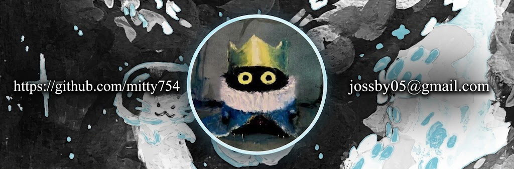

<!--Banner-->

  <picture>
    <source media="(prefers-color-scheme: dark)" srcset="./my_banner.jpg">
    <source media="(prefers-color-scheme: light)" srcset="./my_banner.jpg">
    
  </picture>

<!--Night Owl image-->

  

<!--Header Name-->
# :smile_cat: ᴛᴀʟ ᴠᴇᴢ...ᴍᴇ ᴘᴀsᴇ ᴄᴏɴ ʟᴏs ɢᴀᴛᴏs!
 
*Perdido Digitalmente (Desarrollador / Programador)*
  

<!--Start Intro-->               

Soy desarrollador Full Stack y entusiasta del Machine Learning, con una enorme preferencia por Python, React.js, Node.js, Django, RDBMS, REST API y la visualización de datos. 

- ✨ Vida de estudiante :)
- 🌱 Cada día me quedo mas ciego pero es divertido.
- 🏙 Toda una vida para aprender...ojala alcance.
- 💁‍♂️ Todo es culpa de Bill.
- ✍ Todo esto obvio no es profesional, pero por ahora estará bien, creo.
<!--End Intro-->

<!--Languages and Tools Section-->   
 
 
<h2 align="center">Lenguajes y Herramientas</h2> 

 

<!--Trophies Section-->   
<h2 align="center">🏆 Trofeos de Github 🏆</h2>
<h2 align="center">Cargando...osea nada jajajaj...aun</h2> 
 
 

<!--Github stats Table--> 
<h2 align="center">📊 Estadísticas de Github 📊</h2>

<table width="100%">
  <tr>
    <td width="33%" align="center">
      <h3><strong>Gɪᴛʜᴜʙ Sᴛᴀᴛs</strong></h3>
      
    </td>
    <td width="33%" align="center">
      <h3><strong>Sᴛʀᴇᴀᴋ Sᴛᴀᴛs</strong></h3>
      
    </td>
    <td width="33%" align="center">
      <h3><strong>Tᴏᴘ Lᴀɴɢᴜᴀɢᴇs</strong></h3>
      
    </td>
  </tr>
</table>

 

<!--Dynamic Quote card updated everyday at 12 PM--> 
<h2 align="center">🌟 Tʜᴏᴜɢʜᴛ ᴏғ ᴛʜᴇ Dᴀʏ 🌟</h2>

<!--STARTS_HERE_QUOTE_CARD-->

    

<!--ENDS_HERE_QUOTE_CARD-->

<!--Contact Section--> 

<h2 align="center">🤝 Cᴏɴɴᴇᴄᴛ Wɪᴛʜ Mᴇ 🤝 </h2>

 
  

<!--Footer--> 

  

------
